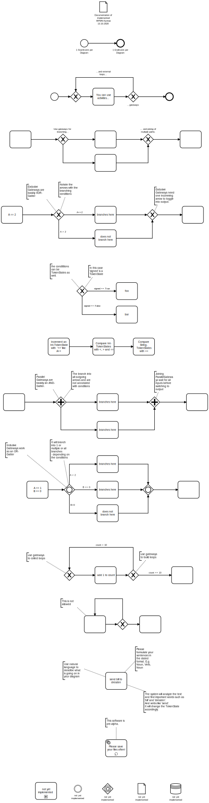

# Syntax of BPMN-diagrams

BPMN-Analyzer implements some useful elements of BPMN.
Open the attached *.bpmn file in [bpmn-io](https://demo.bpmn.io) to find a 
comprehensive documentation of the allowed syntax.

Or look at it here:

## Syntax Documentation
